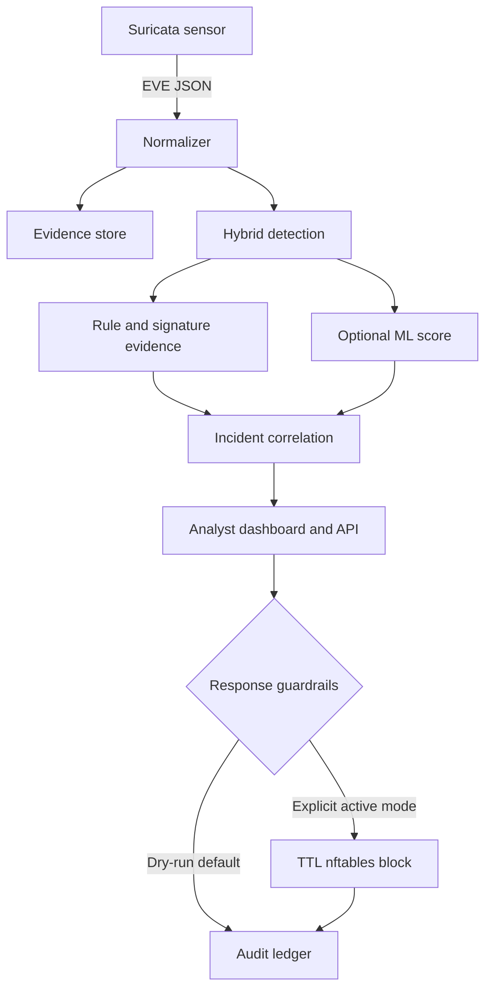

# Vajra Sentinel

**Evidence-first hybrid network IDS/IPS for analyst-ready detection, investigation, and safe response.**

Vajra Sentinel turns Suricata EVE telemetry into explainable detections, correlated incidents, and reversible containment actions. It combines signature evidence, stateful behavior analytics, and an optional supervised flow model without allowing an opaque ML score to block traffic on its own.

> Built by **Darshnoor Kaur** as a SOC / Network Security engineering portfolio project. Defensive use only on systems you own or are authorized to monitor.

## Why this project is different

Most portfolio IDS projects stop at a packet table, use a model trained on features unavailable at runtime, or report synthetic accuracy as if it were production evidence. Vajra Sentinel is designed around the questions a security lead will ask:

- What exact evidence caused this alert?
- Can the sensor reproduce every model feature?
- What are the detection limitations and likely false positives?
- Can an analyst reverse a containment action?
- Is active blocking impossible to enable accidentally?
- Can another engineer run, test, and challenge the system?

## Proof, not promises

| Capability | Implementation | Evidence |
| --- | --- | --- |
| Real telemetry contract | Suricata EVE JSON normalization for alerts, flows, DNS, HTTP, and TLS, with payload/secret redaction | `app/services/normalizer.py` |
| Signature detection | Preserves SID, category, action, `flow_id`, Community ID, and packet reference | Detection evidence drawer + API |
| Stateful analytics | Port scan, SSH repetition, DNS tunneling pattern, low-jitter beaconing, asymmetric transfer | Deterministic unit tests |
| Incident correlation | Groups source-related detections in a 15-minute window | SQLite incident store |
| Safe IPS response | TTL-based nftables sets, protected networks, explicit active-mode acknowledgement, rollback | Response ledger + audit log |
| Honest ML | Sensor-compatible feature contract, validation-selected threshold, independent test, artifact SHA-256 | `artifacts/model_metadata.json` |
| Engineering quality | Typed schemas, bounded inputs, parameterized SQL, CSP/security headers, CI and dependency audit | 38 tests, 90.40% coverage |
| Supply-chain evidence | CycloneDX SBOM plus dependency and static-security scans | `artifacts/sbom.cdx.json` |

## System architecture



The ML branch is supporting evidence. A model-only detection is never response-eligible.

## What is real and what is simulated

| Area | Status | Meaning |
| --- | --- | --- |
| API, database, rules, correlation, dashboard | Real implementation | Runs locally and processes actual EVE records |
| Suricata adapter and local rules | Real integration | Point `VAJRA_EVE_PATH` at a sensor's `eve.json` |
| nftables containment | Real but safety-gated | Dry-run unless three deliberate controls and Linux privileges are present |
| Included model artifact | Synthetic smoke-test | Proves the entire ML path works; metrics are not a production claim |
| Official model path | Reproducible | Train with the official UNSW-NB15 split after downloading from UNSW |
| Built-in attack story | Safe lab simulation | Generates metadata-only events; it sends no attack traffic |

## Run it in five minutes

### Windows PowerShell

```powershell
py -3.12 -m venv .venv
.\.venv\Scripts\Activate.ps1
python -m pip install -e ".[ml,dev]"
.\scripts\run_demo.ps1
```

### Linux / macOS

```bash
python3.12 -m venv .venv
source .venv/bin/activate
python -m pip install -e ".[ml,dev]"
./scripts/run_demo.sh
```

Open <http://127.0.0.1:8765>. The initial workspace contains a clearly labeled lab scenario. Click **Replay clean simulation** to replace the earlier lab run with a deterministic replay; repeated clicks do not inflate the evidence or incident counts. The API reference is at <http://127.0.0.1:8765/api/docs> in development.

### Docker demo

```bash
docker compose up --build
```

The compose file binds only to `127.0.0.1`, drops all Linux capabilities, uses a read-only root filesystem, and keeps response in dry-run mode.

## Connect a real Suricata sensor

1. Install Suricata on an authorized Linux sensor.
2. Merge `suricata/eve-output.yaml` into the host configuration.
3. Add `suricata/local.rules`, then validate with `suricata -T` before restart.
4. Set `VAJRA_EVE_PATH` to the readable `eve.json` path.
5. Start Vajra Sentinel. New JSONL records are tailed and normalized automatically.

Suricata's EVE facility emits alerts, anomalies, metadata, and protocol records as JSON; its `flow_id` and Community ID fields support cross-record correlation. See the official [EVE output](https://docs.suricata.io/en/latest/output/eve/eve-json-output.html) and [EVE JSON format](https://docs.suricata.io/en/suricata-8.0.0/output/eve/eve-json-format.html) documentation.

## Detection catalog

| Rule | Detection | Evidence threshold | ATT&CK |
| --- | --- | --- | --- |
| `VG-BEH-001` | Probable network service scan | ≥20 unique destination ports from one source in 60 s | T1046 |
| `VG-BEH-002` | Repeated SSH connections | ≥12 connections to one SSH destination in 60 s; explicitly not called failed logins | T1110, T1021.004 |
| `VG-BEH-003` | Possible DNS tunneling pattern | First label ≥45 characters and entropy ≥3.6 | T1071.004 |
| `VG-BEH-004` | Low-jitter beacon pattern | ≥6 observations, 5–300 s mean interval, coefficient of variation ≤0.12 | T1071 |
| `VG-BEH-005` | Large asymmetric outbound transfer | ≥50 MB sent and ≥10:1 outbound ratio | T1041 |
| `SURICATA-*` | Signature evidence | Direct Suricata signature match with preserved sensor context | Rule metadata |
| `VG-ML-001` | Flow model threshold exceeded | Probability above validation-selected threshold | Supporting evidence only |

ATT&CK mappings are investigation context, not proof of adversary intent. T1046 and T1110 definitions come from the official [MITRE ATT&CK Network Service Discovery](https://attack.mitre.org/techniques/T1046/) and [Brute Force](https://attack.mitre.org/techniques/T1110/) entries.

## Train the model correctly

The included model is trained on deterministic synthetic data so the repository works immediately. Its metadata says `synthetic-smoke-test`, and the dashboard displays a warning.

The packaged artifact was trained with and is served by the pinned `scikit-learn==1.8.0` runtime. This avoids unsupported cross-version joblib loading and makes a fresh Windows installation reproduce the validated environment.

For a recognized experiment, download the official `UNSW_NB15_training-set.csv` and `UNSW_NB15_testing-set.csv`. UNSW documents 175,341 training records, 82,332 testing records, and nine attack categories on the [official dataset page](https://research.unsw.edu.au/projects/unsw-nb15-dataset).

```bash
python -m ml.train \
  --train-csv data/UNSW_NB15_training-set.csv \
  --test-csv data/UNSW_NB15_testing-set.csv \
  --data-origin UNSW-NB15-official
```

The pipeline:

- transforms only fields reproducible from EVE flow records;
- fits preprocessing on training data only;
- selects the decision threshold on a stratified validation split;
- reports final metrics once on the independent official test split;
- stores dataset hashes, row counts, runtime versions, threshold, confusion matrix, FPR, PR-AUC, ROC-AUC, calibration score, and artifact hash;
- refuses to load a model when its SHA-256 or feature contract does not match.

See [Model Card](docs/MODEL_CARD.md) and [Dataset Policy](data/README.md).

## Safe IPS activation

Dry-run is the default and recommended demo mode. Active containment requires all of the following:

1. an authorized Linux response host;
2. root or `CAP_NET_ADMIN`;
3. dedicated nftables sets created by `suricata/nftables-setup.sh`;
4. `VAJRA_IPS_MODE=active`;
5. `VAJRA_ACTIVE_RESPONSE_ACK=I_UNDERSTAND_ACTIVE_BLOCKING`;
6. an analyst-approved, response-eligible signature/rule finding;
7. a source outside every configured protected network.

Blocks expire automatically through nftables timeouts and can be reverted from the API. The application never uses `shell=True`.

## API surface

| Method | Endpoint | Purpose | Auth |
| --- | --- | --- | --- |
| `GET` | `/api/v1/health` | Component readiness | No |
| `GET` | `/api/v1/metrics` | Dashboard metrics and transparent score | No |
| `GET` | `/api/v1/detections` | Filterable finding queue | No |
| `GET` | `/api/v1/incidents` | Correlated cases | No |
| `POST` | `/api/v1/events/ingest` | Authenticated sensor/API ingestion | API key |
| `PATCH` | `/api/v1/incidents/{id}` | Analyst state transition | API key |
| `POST` | `/api/v1/detections/{id}/contain` | Audited TTL containment | API key + guardrails |
| `DELETE` | `/api/v1/response/blocks/{id}` | Revert containment | API key |
| `GET` | `/metrics` | Prometheus text exposition | No |

For production, put the app behind authenticated TLS termination, disable demo mode, use a long random API key, and restrict read endpoints at the reverse proxy. See [Runbook](docs/RUNBOOK.md).

## Verification

```bash
python -m ruff format --check .
python -m ruff check .
python -m pytest --cov=app --cov-report=term-missing
python scripts/validate_artifact.py
```

Current local validation is recorded in [Validation](docs/VALIDATION.md). CI also runs Bandit and `pip-audit`.

## Documentation

- [Architecture and trust boundaries](docs/ARCHITECTURE.md)
- [Threat model](docs/THREAT_MODEL.md)
- [Model card](docs/MODEL_CARD.md)
- [Operations runbook](docs/RUNBOOK.md)
- [Safe demonstration script](docs/DEMO.md)
- [Recruiter briefing](docs/RECRUITER_BRIEF.md)
- [Kill critique and limitations](docs/KILL_CRITIQUE.md)
- [Release changelog](CHANGELOG.md)
- [OpenAPI contract](docs/openapi.json)
- [Security policy](SECURITY.md)

## License

MIT © 2026 Darshnoor Kaur
