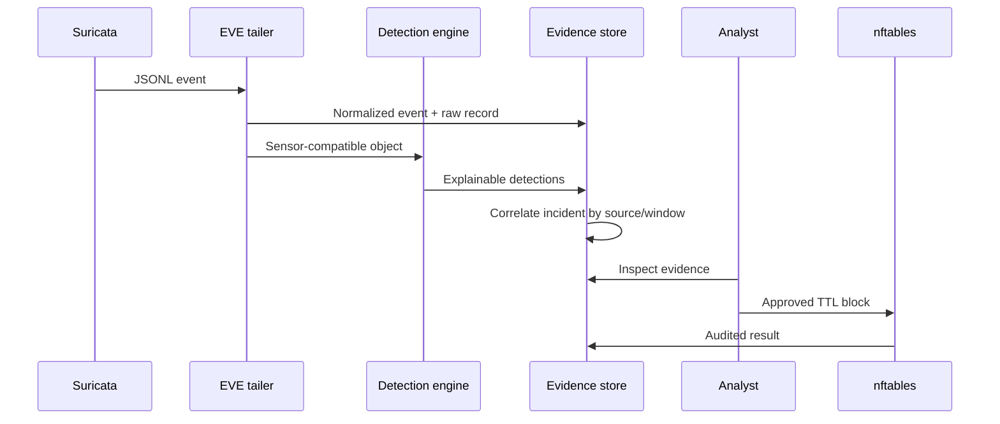

# Architecture and design decisions

## Goals

Vajra Sentinel is a single-sensor portfolio-grade platform that demonstrates the complete defensive loop: collect, normalize, detect, correlate, investigate, contain, and audit. It favors a small number of inspectable components over infrastructure theatre.

## Data flow

## Trust boundaries

| Boundary | Untrusted input | Control |
| --- | --- | --- |
| EVE file → application | Sensor JSON lines | 2 MB record cap, JSON parsing, strict Pydantic types, IP validation, payload/secret redaction |
| HTTP client → API | Query/body/header values | bounded pagination, typed schemas, API-key mutation auth, rate limiting |
| Model artifact → process | Joblib can execute code | only a configured local artifact, SHA-256 match, exact feature-contract match |
| Application → firewall | Source address and TTL | `ipaddress` parsing, protected networks, eligible-detection policy, argv execution without a shell |
| Browser → dashboard | Detection text derived from telemetry | same-origin CSP and HTML escaping |

## Component choices

### SQLite with WAL

SQLite keeps the demo reproducible and supports atomic state changes without another service. Every operation opens a short-lived connection, enables foreign keys, uses parameterized SQL, and commits explicitly. This is not the horizontal-scaling story; PostgreSQL or a security data lake is the production migration path.

### Stateful in-process rules

The behavior engine uses bounded time windows and per-source/pair deques. This makes threshold logic visible and unit-testable. Restarting the process resets short-term behavior state; long-term production analytics should use a stream processor or durable feature store.

### ML as corroboration

The model contract contains only fields derivable from both UNSW-NB15 and EVE flows. ML findings set `response_eligible=false`. This intentionally sacrifices marketing drama for defensible decision-making.

### nftables sets with timeouts

Dedicated IPv4 and IPv6 sets provide idempotent, reversible, time-bounded containment. Vajra Sentinel never rewrites an existing firewall policy and ships a cleanup script limited to its dedicated table.

## Failure behavior

- Missing EVE file: dashboard stays available and reports `awaiting-file`.
- Invalid EVE line: line is skipped and logged; the tailer continues.
- Missing or invalid model: rules-only mode remains operational.
- Database failure: request fails; no firewall action should be attempted before evidence validation.
- nftables failure: subprocess exception prevents an `active` success entry.
- Browser/API failure: dashboard reports degraded state and does not invent data.
